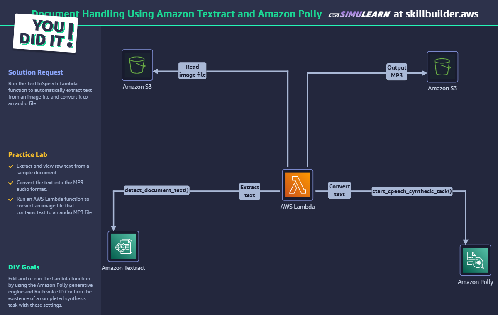

# Amazon Textract & Polly Document Processing Lab

## 🎯 Overview

This lab demonstrates the implementation of an AI-powered document processing pipeline using Amazon Textract for text extraction and Amazon Polly for text-to-speech conversion. The solution automates the conversion of document images into accessible audio files through a serverless architecture.

## 🛠️ Skills Demonstrated

### **Cloud Computing & AI Services**
- **Amazon Textract**: Machine learning-based OCR and document analysis
- **Amazon Polly**: Neural text-to-speech synthesis with natural voices
- **AWS Lambda**: Serverless computing for event-driven automation
- **Amazon S3**: Cloud storage for document input and audio output

### **Programming & Development**
- **Python Programming**: AWS SDK (Boto3) integration and API handling
- **Event-Driven Architecture**: Serverless function triggers and automation
- **Error Handling**: Robust exception management and logging
- **API Integration**: Multi-service AWS API orchestration

### **Document Processing & AI**
- **Optical Character Recognition (OCR)**: Text extraction from images and PDFs
- **Natural Language Processing**: Text preprocessing and formatting
- **Audio Processing**: Speech synthesis and audio file generation
- **Accessibility**: Converting visual content to auditory format

## 📋 Implementation Steps

### **Step 1: Environment Setup**
1. **AWS Service Configuration**
   - Enable Amazon Textract service in AWS Console
   - Configure Amazon Polly with appropriate voice settings
   - Set up S3 bucket for document storage and audio output
   - Create IAM roles with necessary permissions

2. **Lambda Function Preparation**
   - Create new Lambda function with Python runtime
   - Configure environment variables for S3 bucket name
   - Set appropriate timeout and memory allocation

### **Step 2: Document Upload & Processing**
1. **S3 Bucket Configuration**
   - Upload sample document (JPEG/PNG format)
   - Configure bucket policies for Lambda access
   - Set up event triggers for automatic processing

2. **Textract Integration**
   - Implement `detect_document_text` API call
   - Configure document source (S3 object reference)
   - Process extracted text blocks and lines

### **Step 3: Text Processing & Speech Synthesis**
1. **Text Extraction Logic**
   ```python
   # Extract and concatenate text from Textract response
   for item in textract_response["Blocks"]:
       if item["BlockType"] == "LINE":
           text2speech = text2speech + ' ' + item["Text"]
   ```

2. **Polly Configuration**
   - Select neural voice engine (Amy)
   - Configure output format (MP3)
   - Set S3 output destination
   - Initiate synthesis task

### **Step 4: Automation & Testing**
1. **Lambda Function Deployment**
   - Package and deploy function code
   - Configure event triggers
   - Test with sample documents

2. **End-to-End Testing**
   - Upload test documents to S3
   - Verify automatic Lambda trigger
   - Validate audio output generation
   - Test audio playback quality

### **Step 5: Monitoring & Optimization**
1. **Performance Monitoring**
   - CloudWatch logs analysis
   - Function execution metrics
   - Error tracking and debugging

2. **Quality Optimization**
   - Voice selection and customization
   - Text preprocessing improvements
   - Audio quality enhancement

## 🖼️ Lab Screenshots

### Architecture & Setup

*Complete solution architecture showing the document processing workflow*

### Lambda Function Testing

*Testing the TextToSpeech Lambda function with sample events*

### Polly Synthesis Task

*Amazon Polly S3 synthesis task creation and monitoring*

### Audio Output

*Successfully generated MP3 audio file stored in S3 bucket*

## 💻 Core Implementation

```python
import boto3
import os

# Environment configuration
s3_bucket = os.environ['BUCKET_NAME']
sample_file = 'textract_sample.jpeg'

def lambda_handler(event, context):
    # Initialize AWS service clients
    textract_client = boto3.client('textract')
    text2speech = ''

    # Extract text from document using Textract
    textract_response = textract_client.detect_document_text(
        Document={
            'S3Object': {
                'Bucket': s3_bucket,
                'Name': sample_file
            }
        }
    )

    # Process extracted text blocks
    for item in textract_response["Blocks"]:
        if item["BlockType"] == "LINE":
            text2speech = text2speech + ' ' + item["Text"]

    print(text2speech)  # Log extracted text

    # Convert text to speech using Amazon Polly
    polly_client = boto3.client('polly')

    response = polly_client.start_speech_synthesis_task(
        VoiceId='Amy',
        OutputFormat='mp3',
        OutputS3BucketName=s3_bucket,
        OutputS3KeyPrefix='output',
        Text=text2speech,
        Engine='neural'
    )

    return {
        'statusCode': 200,
        'body': 'Speech synthesis task started successfully'
    }
```

## 🚀 Business Impact & Applications

### **Accessibility Enhancement**
- **Document Accessibility**: Convert visual documents to audio for visually impaired users
- **Multi-Modal Content**: Provide both visual and auditory content consumption options
- **Compliance**: Meet accessibility standards and regulations

### **Process Automation**
- **Manual Work Reduction**: Eliminate manual transcription and audio creation
- **Scalable Processing**: Handle large volumes of documents automatically
- **Cost Efficiency**: Reduce operational costs through automation

### **Enterprise Applications**
- **Customer Service**: Automated document reading for phone support
- **Training Materials**: Convert documentation to audio training content
- **Content Management**: Enhance document systems with audio capabilities

## 📁 File Structure

```
amazon-textract-polly-lab/
├── README.md                          # This documentation file
├── amazon-textract-polly-lab.html     # Lab presentation page
├── AWS SimuLearn textract and polly.txt # Lab instructions and context
├── output.f4d05f60-cfbb-449b-9282-3dd8d4a1c380.mp3 # Sample audio output
├── code/                              # Complete source code directory
│   ├── README.md                      # Code documentation and deployment guide
│   ├── lambda_function.py             # Original lab implementation
│   ├── lambda_function_enhanced.py    # Production-ready version with error handling
│   ├── requirements.txt               # Python dependencies
│   └── deployment.yaml                # AWS SAM deployment template
└── screenshots/                       # Lab screenshots directory
    ├── DocumentHandlingUsingAmazonTextractandAmazonPolly.png
    ├── new audio mp3 in s3.png
    ├── s3synthesis task.png
    └── test event TextToSpeechTest.png
```

## 💻 Source Code

The complete implementation is available in the [`code/`](code/) directory:

- **[`lambda_function_enhanced.py`](code/lambda_function_enhanced.py)** - Production-ready Lambda function with comprehensive error handling, logging, and documentation
- **[`requirements.txt`](code/requirements.txt)** - Python dependencies and optional packages for enhanced functionality
- **[`deployment.yaml`](code/deployment.yaml)** - AWS SAM template for automated infrastructure deployment
- **[`README.md`](code/README.md)** - Detailed code documentation, deployment instructions, and troubleshooting guide

## 🔧 Technical Requirements

- **AWS Account** with appropriate service permissions
- **Python 3.x** runtime environment
- **Boto3 SDK** for AWS service integration
- **S3 Bucket** with read/write permissions
- **IAM Roles** with Textract, Polly, and S3 access

## 📈 Next Steps & Enhancements

1. **Multi-Format Support**: Extend to handle PDF and Word documents
2. **Voice Customization**: Implement voice selection based on content type
3. **Batch Processing**: Handle multiple documents simultaneously
4. **Quality Optimization**: Add text preprocessing for better speech output
5. **Real-time Processing**: Implement streaming for large documents

---

*This lab demonstrates practical implementation of AI services for document accessibility and automation - essential skills for modern cloud solutions.*