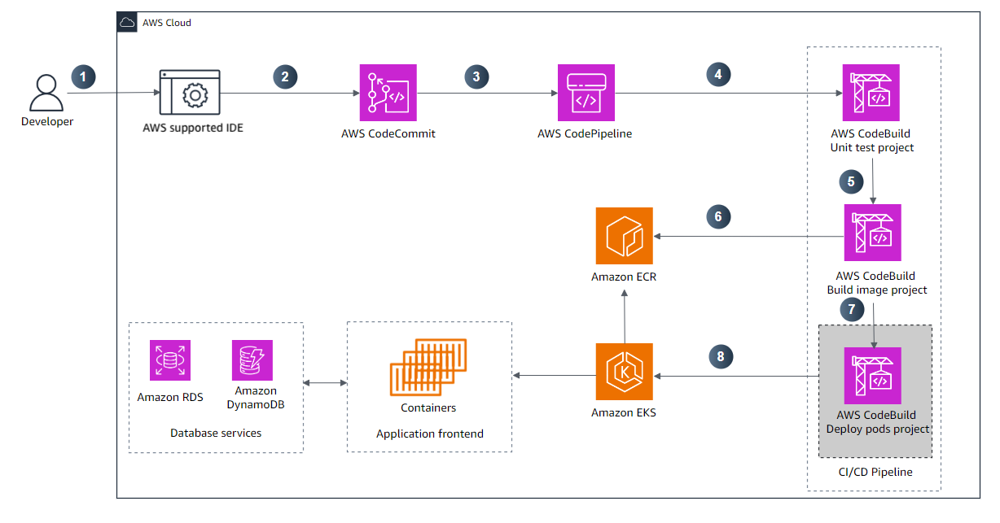

# AWS DevOps Capstone Project - CI/CD Pipeline with Kubernetes

## 🎯 Overview

This capstone project demonstrates the complete implementation of a modern DevOps pipeline using AWS services. The project transforms a Python Django web application into a fully containerized, automatically deployed solution using CI/CD best practices and Kubernetes orchestration.

## 🛠️ Skills Demonstrated

### **DevOps & CI/CD**
- **AWS CodePipeline**: End-to-end CI/CD pipeline automation
- **AWS CodeBuild**: Automated testing, building, and deployment
- **AWS CodeCommit**: Source code version control and management
- **Continuous Integration**: Automated unit testing and code validation
- **Continuous Deployment**: Automated application deployment and updates

### **Containerization & Orchestration**
- **Docker**: Container image creation and management
- **Amazon ECR**: Container registry for secure image storage
- **Amazon EKS**: Managed Kubernetes cluster deployment
- **Kubernetes**: Container orchestration and application scaling
- **Application Load Balancer**: Traffic distribution and high availability

### **Web Development & Testing**
- **Python & Django**: Full-stack web application development
- **Unit Testing**: Comprehensive test suite implementation
- **Database Integration**: Multi-database architecture (RDS + DynamoDB)
- **Frontend Development**: UI/UX improvements and enhancements

### **Cloud Architecture & Infrastructure**
- **Infrastructure as Code**: Automated resource provisioning
- **Microservices Architecture**: Scalable application design
- **Database Management**: Relational and NoSQL database integration
- **Security Best Practices**: IAM roles, container security, and access control

## 📋 Implementation Steps

### **Step 1: Development Environment Setup**
1. **IDE Configuration**
   - Set up AWS Cloud9 or compatible IDE
   - Configure development environment
   - Clone application repository from CodeCommit

2. **Application Analysis**
   - Review existing Python Django codebase
   - Understand application architecture and dependencies
   - Analyze current database integrations

### **Step 2: Application Enhancement**
1. **Code Improvements**
   - Enhance user interface and user experience
   - Implement new backend functionality
   - Optimize application performance

2. **Testing Implementation**
   - Create comprehensive unit test suite
   - Implement test automation frameworks
   - Validate application functionality

### **Step 3: CI/CD Pipeline Development**
1. **CodePipeline Setup**
   - Design multi-stage pipeline architecture
   - Configure source code triggers
   - Set up automated pipeline execution

2. **CodeBuild Projects**
   - **Unit Test Project**: Automated testing execution
   - **Build Image Project**: Container image creation
   - **Deploy App Project**: Kubernetes deployment

### **Step 4: Containerization**
1. **Docker Implementation**
   - Create optimized Dockerfile
   - Build and test container images locally
   - Implement multi-stage builds for efficiency

2. **ECR Integration**
   - Set up Amazon ECR repository
   - Configure image tagging strategies
   - Implement image scanning and security

### **Step 5: Kubernetes Deployment**
1. **EKS Cluster Setup**
   - Provision managed Kubernetes cluster
   - Configure worker nodes and networking
   - Set up cluster security and access control

2. **Application Deployment**
   - Create Kubernetes deployment manifests
   - Configure services and ingress
   - Implement rolling updates and rollbacks

### **Step 6: Load Balancing & Scaling**
1. **ALB Configuration**
   - Set up Application Load Balancer
   - Configure health checks and routing
   - Implement SSL/TLS termination

2. **Auto-Scaling Implementation**
   - Configure horizontal pod autoscaling
   - Set up cluster autoscaling
   - Implement resource monitoring

### **Step 7: Database Integration**
1. **Multi-Database Architecture**
   - Amazon RDS for relational data
   - Amazon DynamoDB for NoSQL requirements
   - Database connection optimization

2. **Data Management**
   - Implement database migration strategies
   - Configure backup and recovery
   - Optimize database performance

## 🖼️ Lab Screenshots

### Architecture Diagram

*Complete CI/CD pipeline architecture showing the end-to-end development and deployment workflow*

## 💻 Core Implementation

### CI/CD Pipeline Configuration
```yaml
# buildspec.yml for CodeBuild Unit Testing
version: 0.2
phases:
  install:
    runtime-versions:
      python: 3.9
  pre_build:
    commands:
      - echo Installing dependencies...
      - pip install -r requirements.txt
  build:
    commands:
      - echo Running unit tests...
      - python manage.py test
      - echo Unit tests completed
  post_build:
    commands:
      - echo Build completed on `date`
```

### Docker Configuration
```dockerfile
# Multi-stage Dockerfile for optimized builds
FROM python:3.9-slim as builder
WORKDIR /app
COPY requirements.txt .
RUN pip install --no-cache-dir -r requirements.txt

FROM python:3.9-slim
WORKDIR /app
COPY --from=builder /usr/local/lib/python3.9/site-packages /usr/local/lib/python3.9/site-packages
COPY . .
EXPOSE 8000
CMD ["python", "manage.py", "runserver", "0.0.0.0:8000"]
```

### Kubernetes Deployment
```yaml
# Kubernetes deployment manifest
apiVersion: apps/v1
kind: Deployment
metadata:
  name: django-app
spec:
  replicas: 3
  selector:
    matchLabels:
      app: django-app
  template:
    metadata:
      labels:
        app: django-app
    spec:
      containers:
      - name: django-app
        image: <ecr-repository-uri>:latest
        ports:
        - containerPort: 8000
        env:
        - name: DATABASE_URL
          valueFrom:
            secretKeyRef:
              name: db-secret
              key: database-url
```

## 🚀 Business Impact & Applications

### **Development Efficiency**
- **Automated Testing**: Reduce manual testing effort and catch bugs early
- **Faster Deployment**: Automated deployment reduces time-to-market
- **Code Quality**: Consistent quality gates ensure reliable releases

### **Operational Excellence**
- **High Availability**: Kubernetes and ALB ensure 99.9% uptime
- **Scalability**: Auto-scaling handles traffic spikes automatically
- **Monitoring**: Comprehensive observability and alerting

### **Cost Optimization**
- **Resource Efficiency**: Container optimization reduces infrastructure costs
- **Auto-Scaling**: Pay only for resources actually needed
- **Spot Instances**: Leverage cost-effective compute options

## 📁 File Structure

```
capstone-project/
├── README.md                    # This documentation file
├── capstone.html               # Lab presentation page
├── style.css                  # Custom styling
├── desc.txt                   # Project description
├── diagdesc.txt              # Architecture diagram description
├── code/                       # Complete source code directory
│   ├── buildspec.yml           # AWS CodeBuild build specification
│   └── Dockerfile              # Multi-stage Docker container configuration
└── screenshots/               # Lab screenshots directory
    └── capstone-arch-diagram.png  # Complete architecture diagram
```

## 💻 Source Code

The complete CI/CD implementation is available in the [`code/`](code/) directory:

- **[`buildspec.yml`](code/buildspec.yml)** - AWS CodeBuild specification with comprehensive build, test, and deployment phases including unit testing, code quality checks, security scanning, and Docker image creation
- **[`Dockerfile`](code/Dockerfile)** - Multi-stage Docker container configuration optimized for production deployment with security best practices and health checks

## 🔧 Technical Requirements

- **AWS Account** with full DevOps services access
- **Development Environment** (AWS Cloud9 or compatible IDE)
- **Source Code Repository** in AWS CodeCommit
- **Container Registry** (Amazon ECR)
- **Kubernetes Cluster** (Amazon EKS)
- **Database Services** (Amazon RDS + DynamoDB)

## 📈 Pipeline Workflow

### **Automated CI/CD Process**
1. **Code Commit**: Developer pushes changes to CodeCommit
2. **Pipeline Trigger**: CodePipeline automatically initiates
3. **Unit Testing**: CodeBuild runs comprehensive test suite
4. **Image Build**: Container image created and tagged
5. **ECR Push**: Image pushed to Amazon ECR repository
6. **Deployment**: Application deployed to EKS cluster
7. **Health Checks**: Automated validation of deployment success

### **Quality Gates**
- **Unit Test Pass Rate**: 100% test success required
- **Security Scanning**: Container vulnerability assessment
- **Performance Testing**: Load testing validation
- **Health Monitoring**: Application health verification

## 🔍 Advanced Features

1. **Blue-Green Deployment**: Zero-downtime deployment strategy
2. **Rollback Capabilities**: Automated rollback on deployment failure
3. **Multi-Environment Support**: Dev, staging, and production pipelines
4. **Security Scanning**: Automated vulnerability assessment
5. **Performance Monitoring**: Application performance insights

## 🎓 Learning Outcomes

- **End-to-End DevOps**: Complete pipeline implementation experience
- **Cloud-Native Development**: Modern application architecture patterns
- **Automation Mastery**: Comprehensive CI/CD automation skills
- **Containerization Expertise**: Docker and Kubernetes proficiency
- **AWS Services Integration**: Multi-service cloud solution design

---

*This capstone project demonstrates comprehensive DevOps skills essential for modern cloud-native application development and deployment.*