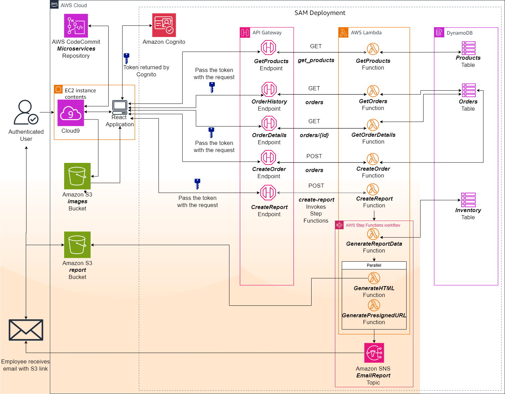
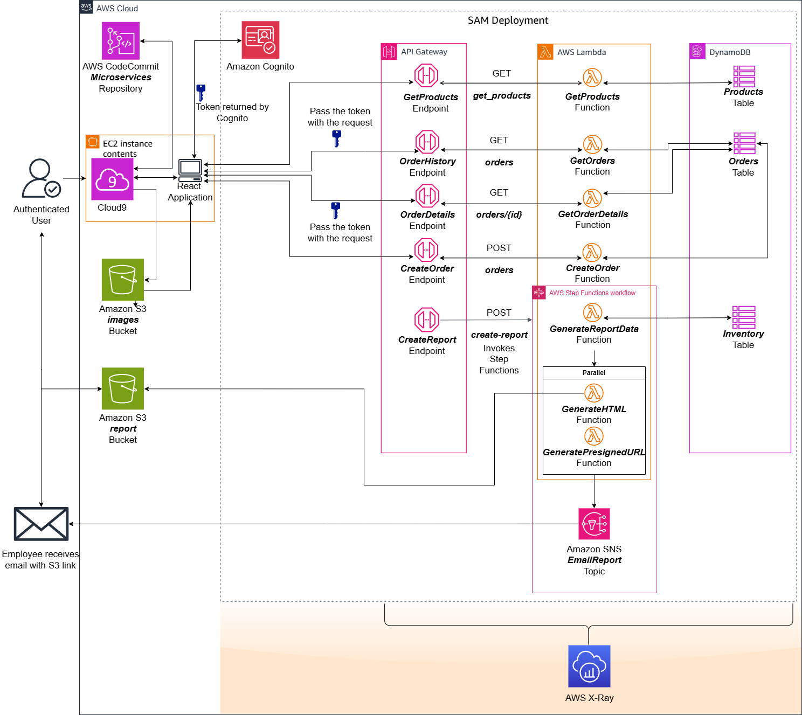

# AWS X-Ray Performance Monitoring & Debugging Lab

## 🎯 Overview

This lab demonstrates the implementation of AWS X-Ray for distributed application tracing and performance monitoring. The solution provides deep insights into application behavior, helping identify bottlenecks, errors, and performance optimization opportunities across microservices architectures.

## 🛠️ Skills Demonstrated

### **Application Performance Monitoring (APM)**
- **AWS X-Ray**: Distributed tracing and service map visualization
- **Performance Analysis**: Latency tracking and bottleneck identification
- **Error Tracking**: Exception monitoring and debugging capabilities
- **Service Dependencies**: Microservices communication mapping

### **Cloud Architecture & DevOps**
- **Distributed Systems**: Multi-service application architecture
- **Observability**: Comprehensive monitoring and logging strategies
- **Debugging**: Production issue identification and resolution
- **Performance Optimization**: Data-driven optimization decisions

### **AWS Services Integration**
- **Lambda Functions**: Serverless computing with tracing
- **API Gateway**: RESTful API monitoring and tracing
- **DynamoDB**: Database operation tracking
- **EC2/ECS**: Containerized application monitoring

## 📋 Implementation Steps

### **Step 1: X-Ray Service Setup**
1. **Enable X-Ray Service**
   - Configure X-Ray service in AWS Console
   - Set up appropriate IAM permissions
   - Enable X-Ray daemon for EC2/ECS instances

2. **Tracing Configuration**
   - Install X-Ray SDK in application code
   - Configure sampling rules for trace collection
   - Set up trace annotations and metadata

### **Step 2: Application Instrumentation**
1. **Lambda Function Tracing**
   - Enable active tracing in Lambda configuration
   - Instrument function code with X-Ray SDK
   - Add custom segments for detailed analysis

2. **API Gateway Integration**
   - Enable X-Ray tracing for API Gateway stages
   - Configure request/response tracing
   - Set up custom trace headers

### **Step 3: Service Map Generation**
1. **Distributed Tracing**
   - Implement trace context propagation
   - Configure downstream service calls
   - Set up database query tracing

2. **Custom Segments**
   - Create custom segments for business logic
   - Add annotations for filtering and search
   - Implement subsegments for detailed operations

### **Step 4: Performance Analysis**
1. **Trace Analysis**
   - Review service maps and dependencies
   - Identify performance bottlenecks
   - Analyze error rates and patterns

2. **Optimization Implementation**
   - Address identified performance issues
   - Optimize database queries and API calls
   - Implement caching strategies

### **Step 5: Monitoring & Alerting**
1. **CloudWatch Integration**
   - Set up X-Ray metrics in CloudWatch
   - Create alarms for performance thresholds
   - Configure notification systems

2. **Continuous Monitoring**
   - Establish baseline performance metrics
   - Monitor trend analysis over time
   - Implement automated remediation

## 🖼️ Lab Screenshots

### Architecture Overview

*Initial application architecture before X-Ray implementation*


*Enhanced architecture with X-Ray tracing and monitoring capabilities*

## 💻 Core Implementation

### X-Ray SDK Integration
```python
from aws_xray_sdk.core import xray_recorder
from aws_xray_sdk.core import patch_all

# Patch AWS services for automatic tracing
patch_all()

@xray_recorder.capture('lambda_handler')
def lambda_handler(event, context):
    # Custom segment for business logic
    subsegment = xray_recorder.begin_subsegment('business_logic')
    try:
        # Application logic here
        result = process_request(event)
        subsegment.put_annotation('request_type', event.get('type'))
        subsegment.put_metadata('request_details', event)
        return result
    except Exception as e:
        subsegment.add_exception(e)
        raise
    finally:
        xray_recorder.end_subsegment()
```

### Custom Tracing Configuration
```python
# Custom sampling configuration
sampling_config = {
    "version": 2,
    "default": {
        "fixed_target": 2,
        "rate": 0.1
    },
    "rules": [
        {
            "description": "High priority endpoints",
            "service_name": "critical-service",
            "http_method": "POST",
            "url_path": "/api/critical/*",
            "fixed_target": 5,
            "rate": 0.5
        }
    ]
}
```

## 🚀 Business Impact & Applications

### **Performance Optimization**
- **Bottleneck Identification**: Pinpoint slow operations and optimize accordingly
- **Resource Utilization**: Optimize AWS resource allocation based on actual usage
- **Cost Reduction**: Identify and eliminate inefficient operations

### **Operational Excellence**
- **Faster Debugging**: Reduce mean time to resolution (MTTR) for issues
- **Proactive Monitoring**: Identify issues before they impact users
- **Service Quality**: Maintain high availability and performance standards

### **Development Efficiency**
- **Code Optimization**: Data-driven development decisions
- **Testing Enhancement**: Validate performance improvements
- **Architecture Insights**: Understand system behavior and dependencies

## 📁 File Structure

```
x-ray-lab/
├── README.md                                    # This documentation file
├── x-ray.html                                  # Lab presentation page
├── style.css                                   # Custom styling
├── code/                                       # Complete source code directory
│   └── lambda_with_xray.py                     # Enhanced Lambda function with X-Ray tracing
└── screenshots/                                # Lab screenshots directory
    ├── AWSDF4-Lab7-Architecture-Before.png     # Before architecture
    └── AWSDF4-Lab7-Architecture-After.png      # After architecture
```

## 💻 Source Code

The complete X-Ray implementation is available in the [`code/`](code/) directory:

- **[`lambda_with_xray.py`](code/lambda_with_xray.py)** - Comprehensive Lambda function demonstrating X-Ray tracing features including custom segments, annotations, performance monitoring, and error tracking

## 🔧 Technical Requirements

- **AWS Account** with X-Ray service access
- **Application Code** instrumented with X-Ray SDK
- **IAM Permissions** for X-Ray service operations
- **Monitoring Strategy** for trace analysis and alerting

## 📈 Key Performance Metrics

### **Latency Metrics**
- **Response Time**: Average and P99 latency tracking
- **Service Duration**: Individual service processing time
- **End-to-End Latency**: Complete request journey analysis

### **Error Tracking**
- **Error Rate**: Percentage of failed requests
- **Exception Analysis**: Detailed error stack traces
- **Service Availability**: Uptime and reliability metrics

### **Throughput Analysis**
- **Request Volume**: Requests per second tracking
- **Capacity Planning**: Resource utilization patterns
- **Scaling Insights**: Auto-scaling trigger analysis

## 🔍 Advanced Features

1. **Custom Annotations**: Business-specific metadata for filtering
2. **Service Lens**: Enhanced service map visualization
3. **Trace Filtering**: Advanced search and filtering capabilities
4. **Integration APIs**: Programmatic access to trace data
5. **Cross-Region Tracing**: Multi-region application monitoring

---

*This lab demonstrates essential application performance monitoring skills crucial for maintaining high-performing, scalable cloud applications.*